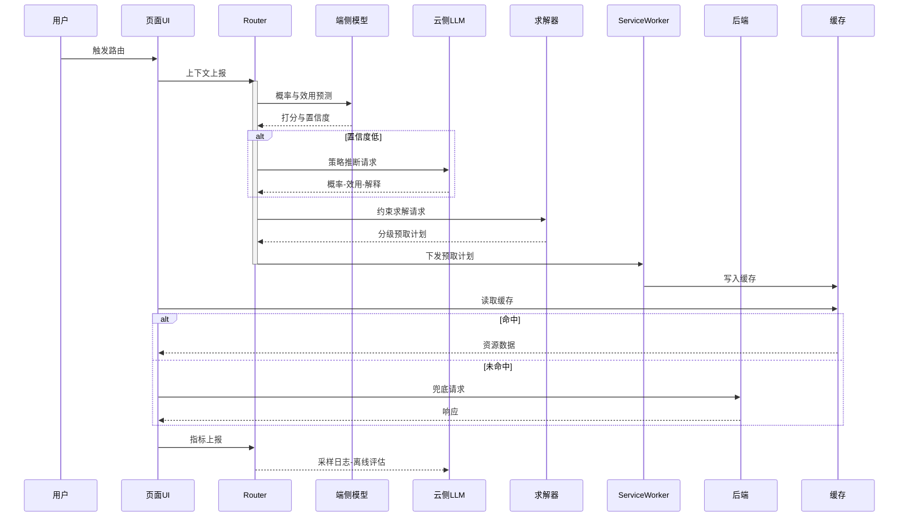
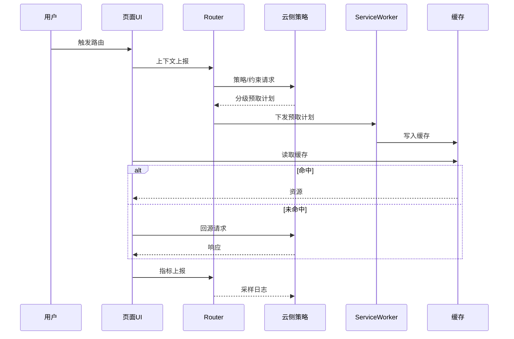

# 技术交底书（按模板填充）

## 一、发明名称
一种基于大模型的智能前端路由分级预取与缓存预算调度方法及系统

## 二、技术领域
涉及前端性能优化与智能调度，具体为利用大模型驱动的路由级分级预取与缓存预算调度。

## 三、背景技术
单页与多页应用在路由切换时受网络、设备与资源冷启动影响，传统预取多为静态或启发式，无法兼顾会话差异与实时网络波动，且缺乏预算约束与可解释性。

## 四、发明目的
在带宽/CPU/存储/隐私等约束下，最大化路由切换路径的时延收益，提升命中率，降低无效预取，并提供可解释与可审计能力。

## 五、发明内容
### 5.1 方法流程
1) 采集上下文并构建路由资源图；
2) 大模型输出候选路由访问概率与资源效用得分（含解释元数据）；
3) 在约束下求解分级预取计划（等级、时序、TTL、淘汰优先级）；
4) 由 Service Worker 执行分级预取（并发控制、退避、SWR、动态TTL、降级/取消、在线重排）；
5) 记录指标并进行反事实评估以校准阈值与预算，选择性更新端侧轻量模型。

### 5.2 系统组成
上下文采集与图构建模块；大模型预测与打分模块；预算求解模块；SW 执行模块；缓存与失效管理模块；反馈学习与反事实评估模块；策略与合规模块。

### 5.3 有益效果
在固定预算内最大化首屏与二跳收益，自适应网络/设备差异，具备可解释审计与灰度回滚；端云蒸馏实现端侧毫秒级推断。

## 六、附图说明
- 图1 分层架构图（`docs/patent/pro-diagrams/pro-fig1-layered-arch.png`，备选：`docs/patent/pro-diagrams/pro-fig1-arch.png`）
- 图2 程序逻辑流程图（`docs/patent/pro-diagrams/pro-fig2-flow.png`）
- 图3 界面交互时序图（`docs/patent/pro-diagrams/pro-fig3-seq.png`）

Mermaid（图3简化版，源码：`docs/patent/diagrams/seq-mermaid.mmd`）

Mermaid（图3更简化版，源码：`docs/patent/diagrams/seq-mermaid-simple.mmd`）

- 图4 异常与降级处理流程图（`docs/patent/pro-diagrams/pro-fig4-exception.png`）
- 图5 数据结构示意图（`docs/patent/pro-diagrams/pro-fig5-classes.png`）

## 七、具体实施方式
### 7.1 术语
分级预取、动态TTL、反事实评估定义同 `disclosure-routing-prefetch.md` 第8章。

### 7.2 预算求解
以效用密度排序或近似整数规划实现，变量与约束同前述说明。

### 7.3 Service Worker 执行
维护优先队列、并发限制、SWR、动态TTL与网络恶化降级；多标签页预取去重。

### 7.4 反馈与评估
采集命中率/LCP/TTI/二跳耗时/带宽/回退率，进行反事实评估并回写阈值与预算。

### 7.5 安全与合规
跨域白/黑名单、隐私标签、权限过滤，不在高隐私会话预取高敏资源。

## 八、权利要求书建议（摘要）
- 方法权（独立）：包含步骤1)–5)，限定大模型输出“路由概率+资源效用+解释”；预算求解产出“等级/时序/TTL/淘汰优先级”；SW 执行支持并发控制、退避、SWR、动态TTL、降级/取消与在线重排；记录指标并进行反事实评估用于阈值校准。
- 系统权（独立）：对应模块划分。
- 装置/介质权（并列）。
- 从属权：动态TTL函数；网络恶化降级；多标签页去重；反事实评估；端云蒸馏与灰度热更新。

## 九、可实施性与部署
在 React Router/Vue Router/Next.js 注入中间件；SW 接管预取；云侧策略训练与端侧蒸馏；ETag 版本热更新与灰度；定期离线评估阈值回写。