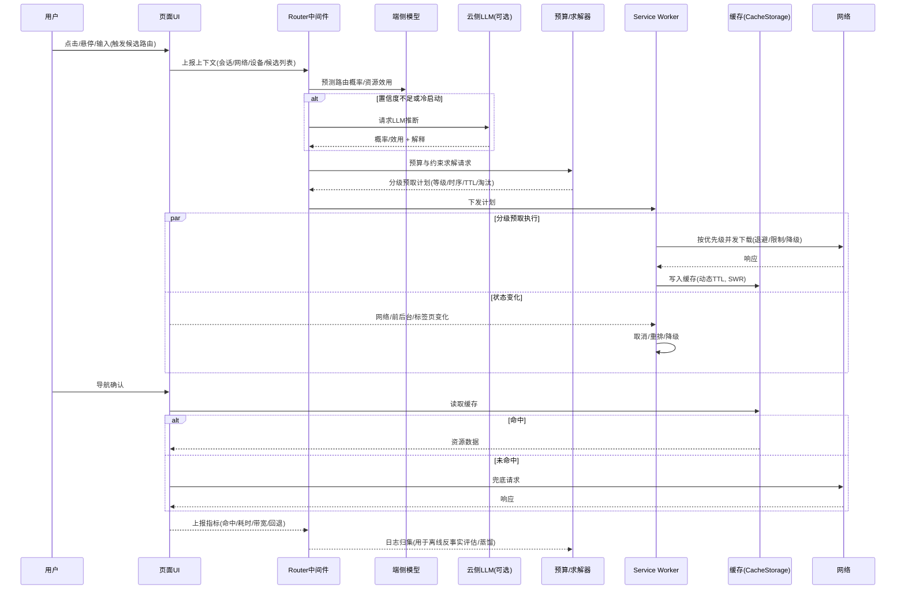
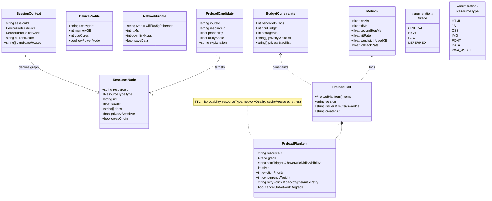

# 一种基于大模型的智能前端路由分级预取与缓存预算调度方法及系统（交底书）

## 1. 技术领域
涉及前端性能优化与智能调度技术，具体为利用大模型（LLM）驱动的前端路由级分级预取与缓存预算调度方法及系统。

## 2. 背景技术
单页与多页应用在路由切换时常受限于网络带宽、设备性能与资源冷启动，导致首屏与二跳耗时较大。传统预取多依赖静态规则或启发式阈值，难以兼顾个体化会话差异与实时网络波动，且缺少预算约束与可解释性。随着大模型在意图理解与上下文推断方面的能力增强，结合 Service Worker（SW）与多级缓存，可构建在预算约束下的“路由→资源”分级预取与动态调度闭环。

## 3. 发明目的
提出一种基于大模型的前端路由分级预取与缓存预算调度方法及系统，在带宽/CPU/存储/隐私等约束下，最大化路由切换路径的时延收益，降低无效预取，提升命中率与用户体验，并提供可解释与可审计能力。

## 4. 技术方案概述
### 4.1 方法流程（概要）
S1. 采集上下文并构建路由资源依赖图；
S2. 由大模型输出候选路由访问概率与资源效用得分，形成预取候选集（含解释元数据）；
S3. 在带宽、CPU、存储、隐私/权限等约束下，求解分级预取计划（等级、时序、TTL、淘汰优先级）；
S4. 由 Service Worker 按计划执行分级预取与缓存写入，支持并发控制、退避、stale-while-revalidate、动态TTL、降级/取消与在线重排；
S5. 记录命中率/耗时/带宽/回退率等指标，进行反事实评估用于阈值与预算校准，选择性更新端侧轻量模型与策略阈值。

### 4.2 系统组成
- 上下文采集与路由资源图构建模块；
- 大模型预测与资源打分模块（云侧模型与端侧蒸馏模型协同）；
- 预算约束与预取计划求解模块；
- Service Worker 执行模块（并发/退避/取消/重排/动态TTL/离线降级）；
- 缓存与失效管理模块（多级缓存、SWR、淘汰策略）；
- 反馈学习与反事实评估模块；
- 策略与合规模块（权限/隐私/跨域白名单、灰度与回滚开关）。

## 5. 有益效果
- 在固定或受限预算内最大化首屏与二跳时延收益，提升命中率并降低无效带宽；
- 自适应网络/设备/会话差异，提供稳健的降级与回退机制；
- 策略可解释与可审计，支持灰度与快速回滚；
- 端云协同蒸馏，实现端侧毫秒级推断与低成本在线执行。

## 6. 附图说明
- 图1：系统架构图。
- 图2：程序逻辑流程图（方法流程）。
- 图3：界面交互流程图（用户-系统时序）。
- 图4：异常与降级处理流程图。
- 图5：数据结构示意图。

## 7. 附图（Mermaid 源码，可在 Typora 直接渲染）

### 图1 系统架构图
```mermaid
graph LR
  subgraph Client[客户端]
    UI[UI/页面] --> Router[Router 中间件]
    Router --> PrefPlan[预取计划(等级/时序/TTL)]
    PrefPlan --> SW[Service Worker 执行器]
    SW --> Cache[CacheStorage / IndexedDB]
    Telemetry[埋点与画像采集] -->|会话/网络/设备/命中/耗时| LogBuf[本地日志缓冲]
    OnDev[端侧轻量模型(蒸馏)] -.预测路由概率/资源效用.-> Router
  end

  subgraph Edge[边缘/网关(可选)]
    EdgeCtrl[策略下发 / 灰度与回滚]
  end

  subgraph Cloud[云侧]
    LLM[大模型策略服务]
    Solver[预算约束求解 / 阈值生成]
    PolicyRepo[策略/版本/白名单]
    Offline[反事实评估 / 训练与蒸馏]
  end

  Router -.冷启动/置信度低时-> LLM
  LLM --> Solver
  Solver -->|等级/TTL/阈值| EdgeCtrl
  EdgeCtrl -->|策略下发| OnDev
  EdgeCtrl -->|策略下发| Router
  Router --> SW
  SW -->|并发/退避/降级| Network[(网络)]
  SW --> UI
  LogBuf --> Offline
  Offline -->|蒸馏/量化权重| OnDev
  Offline --> PolicyRepo
  PolicyRepo --> EdgeCtrl
```

### 图2 程序逻辑流程图（方法流程）
```mermaid
flowchart TD
  A[开始] --> B[采集上下文: 当前/候选路由; 会话/设备/网络画像; 历史命中/耗时]
  B --> C{端侧模型可用且置信度足够?}
  C -- 是 --> D[端侧模型输出: 路由概率分布 + 资源效用得分]
  C -- 否 --> E[调用云侧LLM: 返回概率/效用 + 解释]
  D --> F[合成候选集: 资源ID/等级候选/置信度/解释]
  E --> F
  F --> G[建模约束: 带宽/CPU/存储/隐私/权限]
  G --> H[预算求解: 等级/时序/TTL/淘汰优先级]
  H --> I[下发计划至 Service Worker]
  I --> J[SW 执行: 优先队列并发; 退避; stale-while-revalidate]
  J --> K{状态变化? (网络/前后台/标签页)}
  K -- 是 --> L[在线重排/取消/降级; 动态TTL调整] --> J
  K -- 否 --> M[路由切换: 先读缓存, 未命中则兜底请求]
  M --> N[记录指标: 命中率/首屏&二跳耗时/带宽/回退率]
  N --> O[反事实评估: 不同分级/窗口收益估计; 阈值校准]
  O --> P[可选: 更新端侧模型/阈值/灰度策略]
  P --> Q[结束]
```

### 图3 界面交互流程图（用户-系统时序）


### 图4 异常与降级处理流程图
```mermaid
flowchart TD
  A[开始] --> B{异常/风险触发?}
  B -->|404/循环/鉴权失败| C[构造语义修复候选(基于路由/参数/历史)]
  B -->|网络恶化/预算超限| D[执行降级: 降低等级/取消未开始任务]
  C --> E[合规校验: 权限/隐私/白名单/CORS]
  E -->|通过| F[执行修复: 改写URL/替代目标/引导登录]
  E -->|不通过| G[回退到安全路径/提示用户]
  D --> H[动态TTL与并发重配; 退避与延迟启动]
  F --> I[记录恢复耗时/继续浏览率]
  G --> I
  H --> I
  I --> J[更新阈值/策略(灰度)]
  J --> K[结束]
```

### 图5 数据结构示意图（类图）


## 8. 具体实施方式
### 8.1 名词定义
- 路由资源依赖图：将路由与其静态/数据/媒体/字体等资源建立引用关系与依赖次序的有向图；
- 分级预取：按等级（如 CRITICAL/HIGH/LOW/DEFERRED）与触发时机（hover/click/idle/visibility）对资源分批下载；
- 动态TTL：TTL = f(路由概率、资源类型、网络质量、缓存压力、重试次数) 的单调函数；
- 反事实评估：在不更改线上策略的情况下，基于日志使用重要性采样/双稳健估计不同分级方案的预期收益。

### 8.2 预算求解（示例形式）
以给定会话的候选路由集合 R 及资源集合 Ω，最大化期望收益：
maximize Σ_{r∈R} p(r) · Σ_{o∈Ω(r)} u(o|r) · x(o)
subject to Σ_{o} cost(o)·x(o) ≤ BW_budget，x(o)∈{0,1,2,3}（对应等级及时序窗口），并对隐私/权限/跨域施加硬约束过滤；
可采用启发式或近似整数规划/贪心按“效用密度”排序，配合会话/设备/网络画像自适应阈值。

### 8.3 Service Worker 执行
SW 维护优先队列与并发度限制；网络恶化触发取消/降级与动态TTL收紧；采用 SWR（stale-while-revalidate）在命中陈旧资源时先回填再异步刷新；多标签页通过 BroadcastChannel/SharedWorker 合并预取避免重复下载。

### 8.4 反馈与评估
埋点记录命中率、LCP/TTI、二跳耗时、带宽与回退率；离线反事实评估不同等级/窗口的收益，回写阈值与预算；可选对端侧轻量模型进行小步更新。

### 8.5 安全与合规
对跨域资源施加白/黑名单与隐私标签，禁止高敏资源在高隐私会话中预取；与路由守卫联动过滤不可达资源。

## 9. 权利要求书建议（草案要点）
### 9.1 方法权（独立）
包含 S1–S5 步骤，限定：大模型输出“路由概率+资源效用+解释元数据”；预算约束求解产出“等级/时序/TTL/淘汰优先级”；SW 执行支持并发控制、退避、SWR、动态TTL、降级/取消与在线重排；记录指标并进行反事实评估用于阈值校准。

### 9.2 系统权（独立）
对应各模块：上下文采集、预测与打分、预算求解、SW 执行、缓存管理、反馈与反事实评估、合规模块。

### 9.3 介质/装置权（并列）
计算机设备与存储介质，执行上述方法。

### 9.4 从属权（示例）
- 动态TTL函数定义及其自适应变量；
- 优先队列并发与网络恶化下的取消/降级策略；
- 多标签页去重；
- 反事实评估（重要性采样/双稳健）；
- 端云协同蒸馏与灰度热更新。

## 10. 备选实施例与可选特征
可与异常自愈路由结合，在 404/循环/鉴权失败时调整预取优先级；与路由级渲染路径选择协同，针对 SSR/CSR/ISR 产出差异化资源清单；在弱网或离线状态下启用脱机清单与骨架屏策略。

## 11. 实施效果与部署建议
建议在 React Router/Vue Router/Next.js 注入中间件上报路由候选与资源图；SW 接管预取与缓存。云侧训练“路由→资源等级”策略并生成权重；端侧蒸馏模型进行本地打分；策略通过 ETag/版本热更新与灰度发布；定期离线评估回写阈值。

